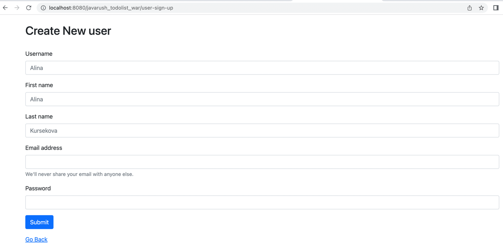
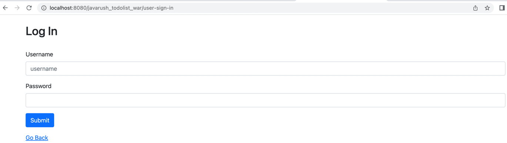
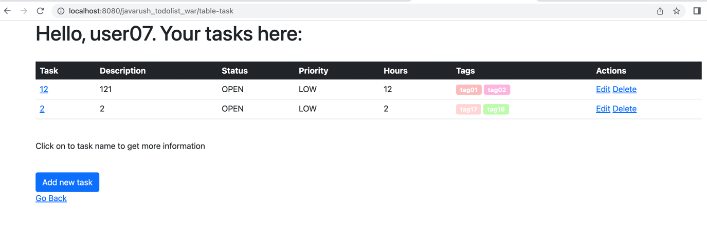
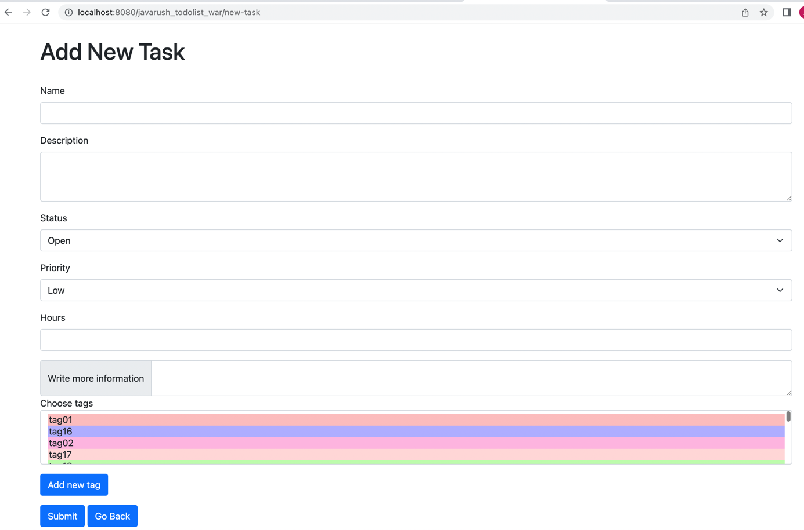
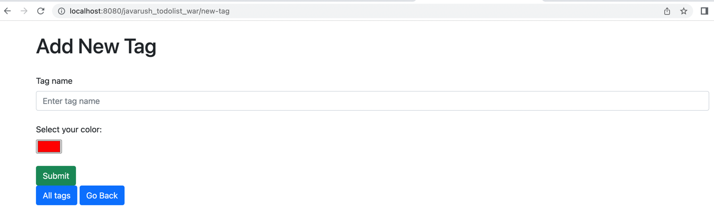
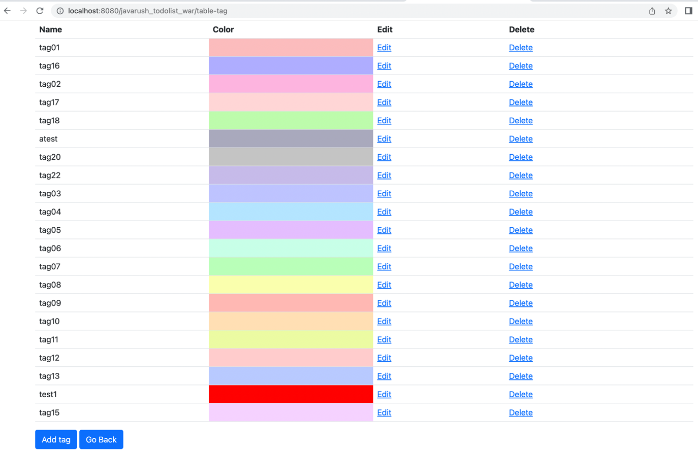
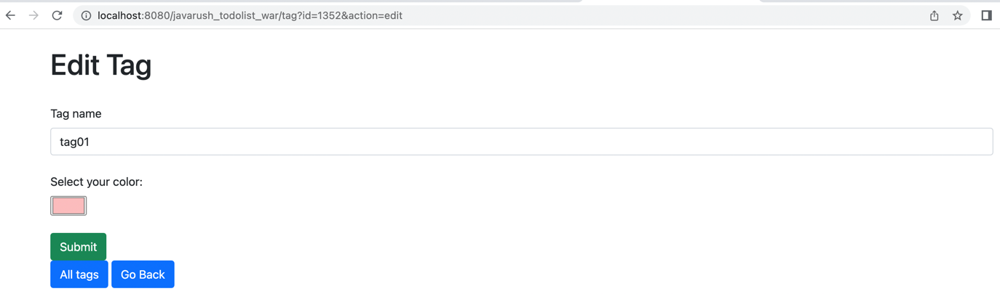

# javarush-todolist

## Introduction

This is the Java EE based application designed for Tomcat 9.  
The application represents todo-list with possibility to create tasks and mark them with tags. 

When user runs the application, appears initial window with options to register new user, sign in and view user's dashboard with its tasks.

New user register form will appear by clicking **[Register]** button: 

New user will be created by clicking **[Submit]** button. 
User will be returned to initial page by clicking **[Go Back]** button.

Log In form will appear by clicking **[Log In]** button: 

User will be logged in by clicking **[Submit]** button.
User will be returned to initial page by clicking **[Go Back]** button.

Dashboard with user's tasks will appear if logged-in user will click **[Open My Board]** button: 

New task creation form will appear by clicking **[Add new task]** button:

New tag creation form will appear by clicking **[Add new task]** button:

Dashboard with all tags will be displayed by clicking **[All tags]** button:

Edit tag form will appear by clicking **[Edit]** button: 

Tag will be deleted by clicking **[Delete]** button. 

# Run application from Docker:

- Install [Docker](https://docs.docker.com/install)
- Open the link https://github.com/akursekova/javarush-todolist/tree/dev and click on Donwnload ZIP
- The name of downloaded project will be javarush-todolist-dev since it was downloaded from the dev branch
- Open project in IntelliJ IDEA
- Open Terminal in IntelliJ IDEA
- Run the command % mvn clean install: in generated target folder will be found javarush-todolist.war
- Make sure that the current directory is javarush-todolist-dev
- $docker-compose up -d
- http://localhost:8080/javarush-todolist

## Structure of the project
This is a Maven project with standard Maven project structure:

`src/main/java` contains java classes  
`src/main/resources` resources used by application  
`src/test` — package to store tests
`pom.xml` is in the root of the project and contains all necessary dependencies for the correct work of the project.

This application has 3 main domains: 
- Task
- Tag
- User, which are located in the `model` package.

In the root folder of the project `dev.javarush.todolist` there are packages:

`command`: transfers main classes mentioned above to the entities which will be used on service and servlet levels  
`components`: contains class _PasswordHashing_ intended for hashing user passwords
`consts`: contains class _WebConstants_ which stores constants used in the application  
`dto`: transfers main classes mentioned above to the entities which will be used on service and servlet levels  
`enums`: contains all the enums used in the application  
`exceptions`: stores all the exceptions  
`listener`: contains AppContextListener class, where all necessary entities are initialized before application starts  
`mapper`: class which helps to transfer main classes mentioned above to the entities which will be used on service and servlet levels  
`middleware`: contains classes which intended for validation of the data which comes from the User Interface  
`provider`: contains class _Provider_ which contains database properties  
`repositories`: stores classes intended to manage entities in the database: save, update, delete.  
`services`: stores classes which implements business logic, intended to manage entities between servlet and repository level  
`servlets`: stores servlet classes

There is a `web.xml` inside `WEB-INF`: it stores the information about configuration of the app.  
In current project it stores information about ExceptionHandlerServlet, which is responsible for error handling.

In the `webapp` package which is the root of the project there are following packages:  
`tag`: contains .jsp files which represent tag creation/modification form, table with all tags  
`task`: contains .jsp files which represent task creation/modification form, table with all task, task information form  
`user`: contains .jsp files which represent sign up and sign in pages  
In the root of the `webapp` package there is an index.jsp, which represent the start page of the application

## Logging
In this project is used Log4j. Logger configuration is in xml format.

Configuration is stored by path: `src/main/resources/log4j2.xml`.

Logs can be recorded to the file on your local computer.

_If this application will be run on your computer, please provide a path to the local folder on your computer for correct work of the application._