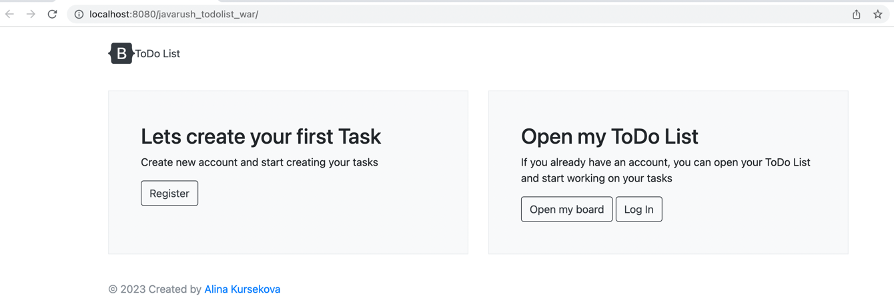

# javarush-todolist

## Introduction

This is the Java EE based application designed for Tomcat 9.  
The application represents todo-list with possibility to create tasks and mark them with tags. 

When user runs the application, appears initial window with options to register new user, sign in and view user's dashboard with its tasks.

New user register form will appear by clicking **[Register]** button: 

New user will be created by clicking **[Submit]** button. 
User will be returned to initial page by clicking **[Go Back]** button.

Log In form will appear by clicking **[Log In]** button: 

User will be logged in by clicking **[Submit]** button.
User will be returned to initial page by clicking **[Go Back]** button.

Dashboard with user's tasks will appear if logged-in user will click **[Open My Board]** button: 

New task creation form will appear by clicking **[Add new task]** button:

New tag creation form will appear by clicking **[Add new task]** button:

Dashboard with all tags will be displayed by clicking **[All tags]** button:

Edit tag form will appear by clicking **[Edit]** button: 

Tag will be deleted by clicking **[Delete]** button. 

# Run application from Docker:

- Install [Docker](https://docs.docker.com/install)
- Open the link https://github.com/akursekova/javarush-todolist/tree/dev and click on Donwnload ZIP
- The name of downloaded project will be javarush-todolist-dev since it was downloaded from the dev branch
- Open project in IntelliJ IDEA
- Open Terminal in IntelliJ IDEA
- Run the command % mvn clean install: in generated target folder will be found javarush-todolist.war
- Make sure that the current directory is javarush-todolist-dev
- $docker build -t javarush-todolist-dev .
- $docker run -p 7777:8080 javarush-todolist-dev
- http://localhost:7777/javarush_todolist_war

## Structure of the project
This is a Maven project with standard Maven project structure:

`src/main/java` contains java classes  
`src/main/resources` resources used by application  
`src/test` — package to store tests
`pom.xml` is in the root of the project and contains all necessary dependencies for the correct work of the project.

In the root folder of the project `dev.javarush.todolist` there are packages:

`command`: responsible for data transportation in necessary format  
`components`: contains classes of main entities of the trading platform  
`consts`: contains classes responsible for error handling  
`dto`: contains classes responsible for adding entities to the repositories  
`enums`: this is the level between servlet and repository. Classes inside the service package are responsible for business logic  
`exceptions`: package with servlets for each entity

There is a `web.xml` inside `WEB-INF`: it stores the information about configuration of the app.  
In current project it stores information about ExceptionHandlerServlet, which is responsible for error handling.
